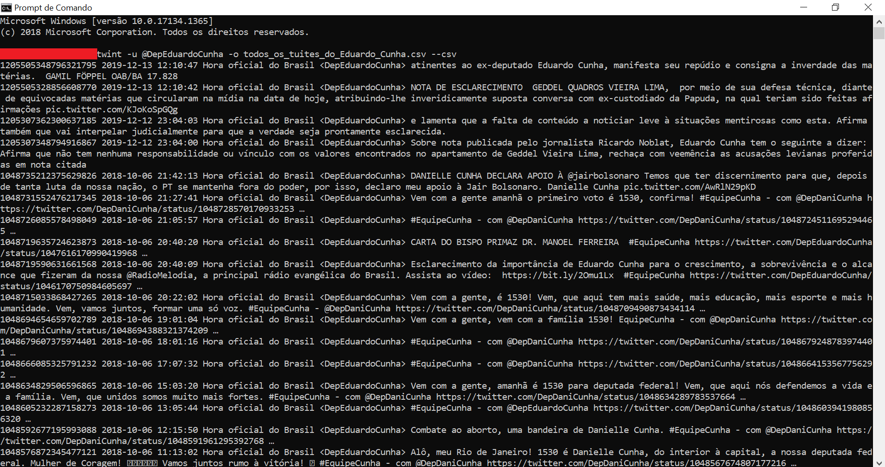

# O tutorial mais fácil do mundo para baixar tweets 🌈

Nesse tutorial, você vai aprender a raspar tuítes de um usuário da forma **mais fácil do mundo**. Sim, da forma **mais fácil do mundo**. 

E nosso usuário será o ex-deputado e conhecido nas redes como 'oráculo brasileiro' Eduardo Cunha.

! [] (cunha.gif)

Duvida? Então para começar, é preciso que você tenha a linguagem de programação mais charmosa instalada no seu computador: Python! 

Para cada sistema operacional, a instalação acontece de uma forma diferente. Veja qual é o seu e siga os passos correspondentes. No site da Python Brasil é possível ver como instalar no  [Windows](https://python.org.br/instalacao-windows/),  [Linux](https://python.org.br/instalacao-linux/)  e  [Mac](https://python.org.br/instalacao-mac/).
    
## Twint: conheça seu novo amor

Antes de começar, é preciso dizer que existem diversas formas de raspar tweets, com códigos mais ou menos complicados, com ou sem o uso da API da plataforma. Eu mesma já devo ter usado uns mil códigos diferentes, pois os limites de raspagem acabam fazendo com que a gente tenha que ser criativo para conseguir os dados.

Neste tutorial nós vamos usar o **Twint**, uma ferramenta que não utiliza a API e não necessita que o usuário tenha conta no Twitter. Para conhecer mais, acesse o repositório [aqui](https://github.com/twintproject/twint/). 

Vamo começar instalando o Twint. No prompt de comando, escreva o comando:

    pip3 install twint

Feito a instalação, vamos já baixar, da maneira **mais fácil do mundo** os tweets de Eduardo Cunha. 

O comando que vamos utilizar fará com que a gente tenha todos os tweets escritos por ele, usando apenas uma linha de código:

    twint -u username -o file.csv --csv
    
Em username vamos colocar a arroba do Eduardo Cunha: `@DepEduardoCunha`. Em file vamos colocar o nome do arquivo csv onde estarão os tweets coletados. Vou chamar de `todos_os_tuites_do_Eduardo_Cunha`. Dessa forma, nosso código ficará assim:

      twint -u @DepEduardoCunha -o todos_os_tuites_do_Eduardo_Cunha.csv --csv

E aí, a mágica acontece e você verá seu computador trabalhando para baixar os dados para você, como na imagem abaixo.

Agora, é só abrir o csv baixado e conferir os dados. 

Fim✨

